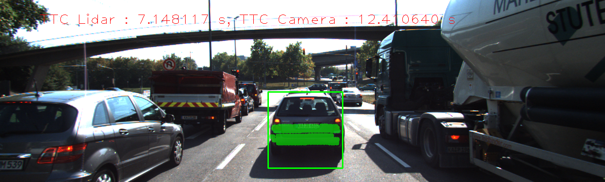

# SFND 3D Object Tracking

Welcome to the final project of the camera course. By completing all the lessons, you now have a solid understanding of keypoint detectors, descriptors, and methods to match them between successive images. Also, you know how to detect objects in an image using the YOLO deep-learning framework. And finally, you know how to associate regions in a camera image with Lidar points in 3D space. Let's take a look at our program schematic to see what we already have accomplished and what's still missing.

In this final project, you will implement the missing parts in the schematic. To do this, you will complete four major tasks: 
1. First, you will develop a way to match 3D objects over time by using keypoint correspondences. 
2. Second, you will compute the TTC based on Lidar measurements. 
3. You will then proceed to do the same using the camera, which requires to first associate keypoint matches to regions of interest and then to compute the TTC based on those matches. 
4. And lastly, you will conduct various tests with the framework. Your goal is to identify the most suitable detector/descriptor combination for TTC estimation and also to search for problems that can lead to faulty measurements by the camera or Lidar sensor. In the last course of this Nanodegree, you will learn about the Kalman filter, which is a great way to combine the two independent TTC measurements into an improved version which is much more reliable than a single sensor alone can be. But before we think about such things, let us focus on your final project in the camera course. 

## Dependencies for Running Locally
* cmake >= 2.8
  * All OSes: [click here for installation instructions](https://cmake.org/install/)
* make >= 4.1 (Linux, Mac), 3.81 (Windows)
  * Linux: make is installed by default on most Linux distros
  * Mac: [install Xcode command line tools to get make](https://developer.apple.com/xcode/features/)
  * Windows: [Click here for installation instructions](http://gnuwin32.sourceforge.net/packages/make.htm)
* Git LFS
  * Weight files are handled using [LFS](https://git-lfs.github.com/)
* OpenCV >= 4.1
  * This must be compiled from source using the `-D OPENCV_ENABLE_NONFREE=ON` cmake flag for testing the SIFT and SURF detectors.
  * The OpenCV 4.1.0 source code can be found [here](https://github.com/opencv/opencv/tree/4.1.0)
* gcc/g++ >= 5.4
  * Linux: gcc / g++ is installed by default on most Linux distros
  * Mac: same deal as make - [install Xcode command line tools](https://developer.apple.com/xcode/features/)
  * Windows: recommend using [MinGW](http://www.mingw.org/)

## Basic Build Instructions

1. Clone this repo.
2. Make a build directory in the top level project directory: `mkdir build && cd build`
3. Compile: `cmake .. && make`
4. Run it: `./3D_object_tracking`.

# Project Writeup

## FP.1 : Match 3D Objects
Lines 265-346 in camFusion_Student.cpp

A local variable `std::map<std::pair<int,int>,int> bbCorrelations` was used to store found correlations between bounding boxes in the frames. The pairs with the highest number of correlations were chosen.

## FP.2 : Compute lidar-based TTC
Lines 196-264 in camFusion_Student.cpp

To dismiss the impact of outliers the points lying outside the band <mean-2 x standard deviation, mean+2 x standard deviation> were removed. This greatly reduces differences between Lidar-based TTC and camera-based TTC. 

## FP.3 : Associate Keypoint Correspondences with Bounding Boxes
Lines 133-146 in camFusion_Student.cpp

## FP.4 : Compute Camera-based TTC
Lines 147-195 in camFusion_Student.cpp

Implementation form the classroom was used to calculate TTC from the images.

## FP.5 : Performance Evaluation 1
The results for the lidar-based TTC indicate that the current implementation struggle with the frames 6-12. This trend appears in the most detector/descriptor configurations. There might few reasons behind this but it is most likely that the equation used to estimate TTC is an approximate and the current framerate is not sufficient to calculate accurately TTC. A similar approach used in calculating TTC from images would likely remove the fluctuations in the TTC estimation as the values for camera-based TTC seem to be more consistent across the frames. 

_Figure 1, frame 6_ 

_Figure 2, frame 7_ 

_Figure 3, frame 8_ 

## FP.6 : Performance Evaluation 2
The results from the evaluation are stored in *\results\results.csv*. 

The first candidates for detector/descriptor were chosen upon the recommendations from the previous project. In this task, FAST+BRISK, FAST+ORB, FAST+SIFT, AAKZE+AKAZE, SIFT+SIFT also produced more credible results than other combinations, especially ORB+ORB or any HARRIS + any descriptor combination. The obtained results are only preliminary and there is a significant number of parameters that can be tuned or techniques to achieve much better results in the TTC estimation. The performance of some selected combination is shown in the figure below.

_Figure 4, TCC performance_ 
